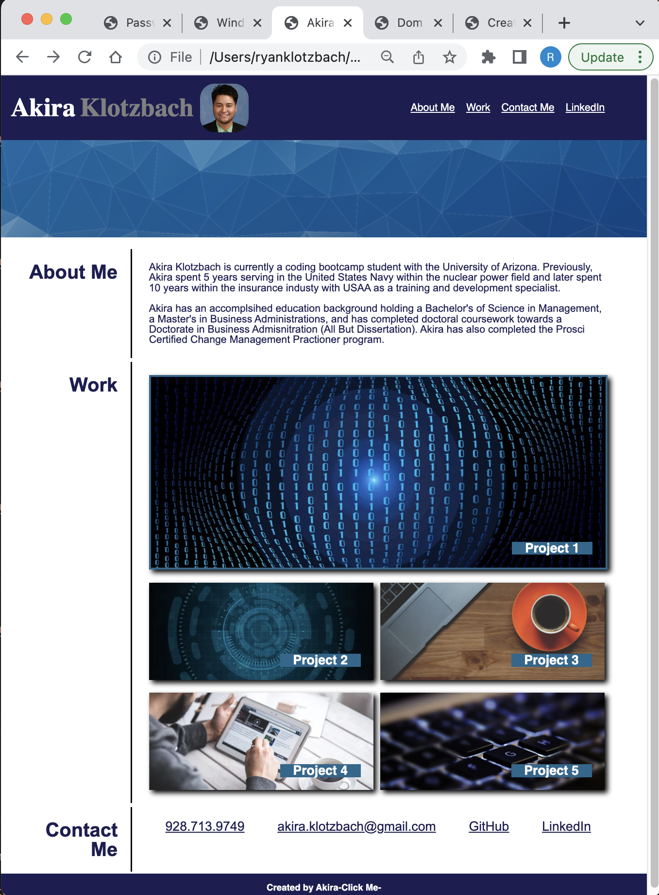

# professional-portfolio

# Description

A portfolio created to showcase works, skills, and talent for employers to review.  The portfolio is created as the starting part towards a complete professional portfolio that will house deployed web applications and projects as they are completed.  This will serve as a showcase for future employers to observe.

  # Link

*  https://raklotzbach.github.io/professional-portfolio/

# Screenshot

